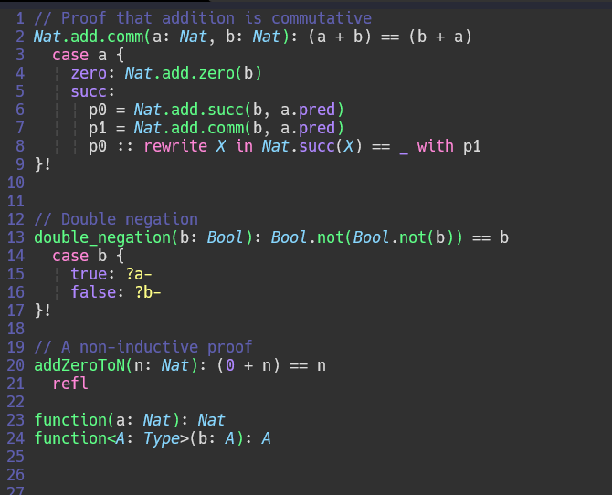

# kind-vim
Syntax file highlight for Kind

## Installation
### On VIM
Clone this repo and past the file "kind.vim" into `~/.vim/syntax/kind.vim` and add in your `.vimrc` file the next line:


```vim
au BufRead,BufNewFile *.kind set filetype=kind
```

### On NeoVim
Clone this repo and past the file "kind.vim" into `~/.config/nvim/syntax/kind.vim` and add in your `init.vim` file the next line:

```vim
au BufRead,BufNewFile *.kind set filetype=kind
```

## Preview

